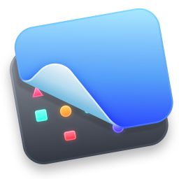
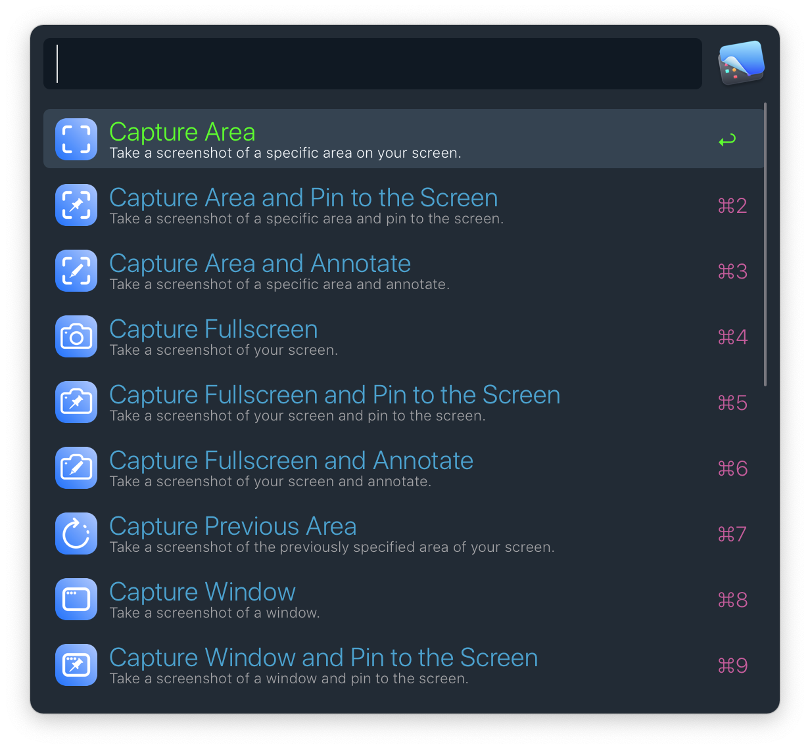
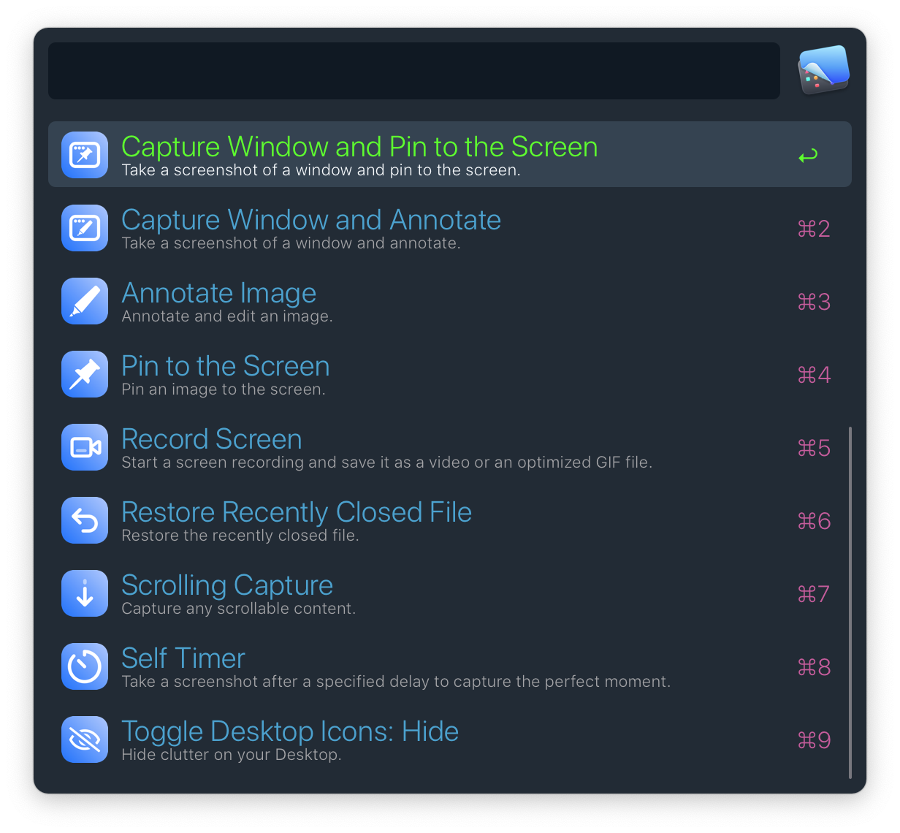
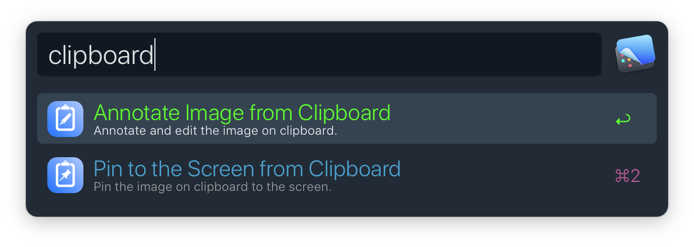
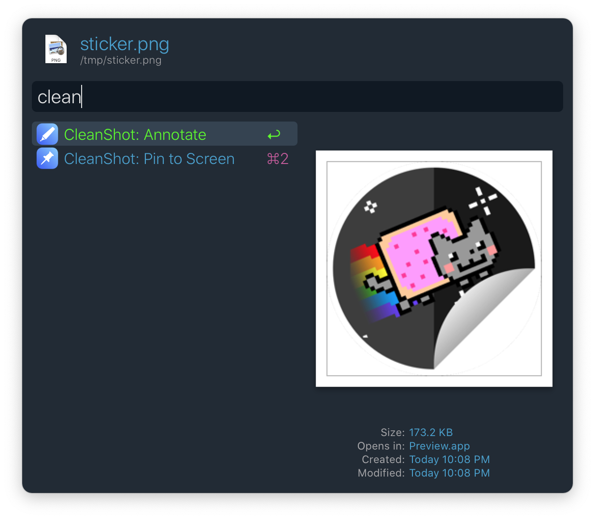

<h1 align="center">
  
<a href="https://github.com/mr-pennyworth/alfred-cleanshot/releases/latest/">
   
   
</a>
  CleanShot X 🤝 Alfred
</h1>

### Requiremens
- [Alfred 4](https://alfredapp.com/)
- [CleanShot X](https://cleanshot.com/) (version `4.2` or above)

### Features
- Capture Area
- Capture Area and Pin to the Screen
- Capture Area and Annotate
- Capture Fullscreen
- Capture Fullscreen and Pin to the Screen
- Capture Fullscreen and Annotate
- Capture Previous Area
- Capture Text using OCR
- Capture Window
- Capture Window and Pin to the Screen
- Capture Window and Annotate
- Annotate Image from Clipboard
- Pin to the Screen from Clipboard
- Annotate Image
- Pin to the Screen
- Record Screen
- Restore Recently Closed File
- Scrolling Capture
- Self Timer
- Show / Hide Desktop Icons
- Open All-in-One Mode
- Open Capture History

### Screenshots

### Credits
This workflow is based on [Raycast][1]'s [CleanShot X script commands][2].

### Icon Credits
Some icons from by srip, Gregor Cresnar, and [freepik][3] from [flaticon][4].

[1]: https://raycast.com
[2]: https://github.com/raycast/script-commands/tree/master/commands/apps/cleanshot
[3]: https://www.freepik.com
[4]: https://www.flaticon.com
